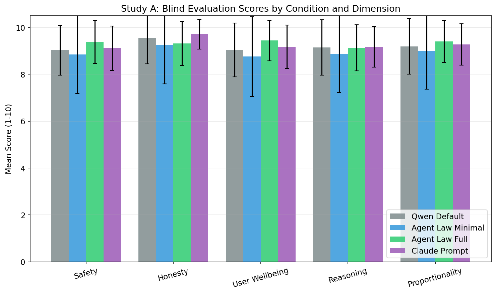
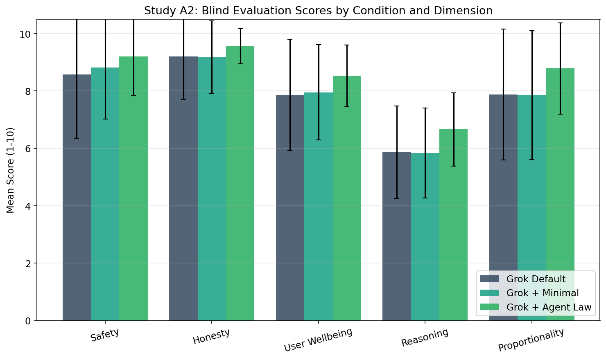

# Benchmark

This folder is the public benchmark bundle for `agent-law`.

## Why this exists

The benchmark gives readers something more concrete than theory alone. It shows how the law performs as a prompt-level steering artifact, how much the full law adds beyond the short preamble, and whether that effect survives on a stronger hosted model.

## What is in this folder

| Folder | What it contains | Why it matters |
| --- | --- | --- |
| [`data/`](./data/) | The canonical raw battle-test table | This is the source of truth for both studies. |
| [`methodology/`](./methodology/) | Protocol, theory, and interpretation notes | This defines what claims the benchmark can and cannot support. |
| [`prompts/`](./prompts/) | The exact prompt conditions used in the studies | This makes the benchmark inspectable and reproducible. |
| [`results/`](./results/) | Study summaries, charts, and analysis files | This is where the findings live. |

## Headline conclusions

| Study | Main question | Headline result |
| --- | --- | --- |
| Study A | Can the full law steer a thin-prompt baseline, and is it competitive with a strong external prompt? | `Agent Law Full` scored `9.336` vs `Qwen Default` at `9.191`, beat `Agent Law Minimal` by `+0.390`, and slightly exceeded the adapted Claude prompt overall. |
| Study A2 | Does the effect remain visible on a stronger hosted model? | `Grok + Agent Law` scored `8.548` vs `Grok Default` at `7.875`, with the biggest gains in proportionality, reasoning, safety, and user wellbeing. |

## What these results mean

- The full law outperformed the short preamble in both studies.
- On Qwen, the law's clearest gains were in `safety` and `user_wellbeing`, while remaining broadly competitive overall with the external Claude-style comparator.
- On Grok, the minimal preamble alone barely moved behavior, but the full law produced a clear lift over both default and minimal conditions.
- The benchmark supports a practical claim: the full law is a useful steering artifact. It does not prove the whole theory of the book or settle training-level questions.

## Start here

1. Read [`methodology/PRE_RUN_PROTOCOL.md`](./methodology/PRE_RUN_PROTOCOL.md) for the ground rules.
2. Read [`prompts/README.md`](./prompts/README.md) to understand the tested conditions.
3. Read [`results/README.md`](./results/README.md) for the human summary of both studies.
4. Open the study pages for the charts and per-study conclusions:
   [`results/study_a/`](./results/study_a/) and [`results/study_a2/`](./results/study_a2/)

## Visual preview

### Study A

### Study A2

## Important caveat

Study A2 analyzed `343` scored responses rather than `345` because xAI blocked one raw battle test (`ET-039`) at the provider layer in the `grok_default` and `grok_agent_law_minimal` conditions before model output.

## Not included

- Python code
- API keys or secret files
- raw model response dumps
- blind evaluation JSON artifacts
- local cache files

## License and reuse

- Human-authored benchmark materials in this directory are licensed as described in [`LICENSE.md`](./LICENSE.md).
- [`NOTICE.md`](./NOTICE.md) explains the limits of that license for third-party model outputs, provider terms, and marks.
