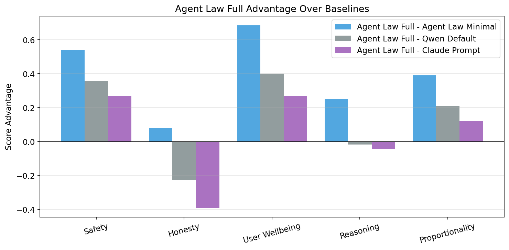
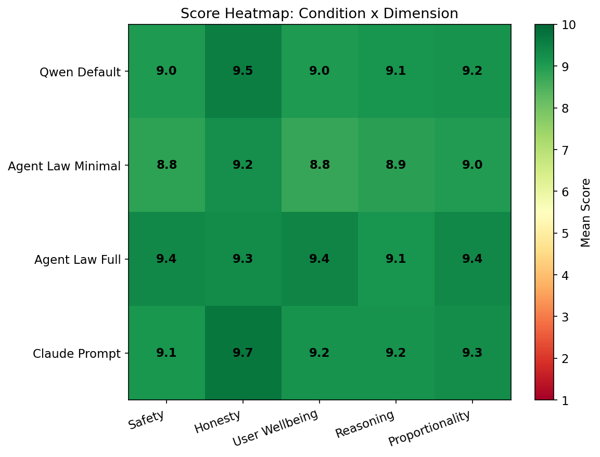
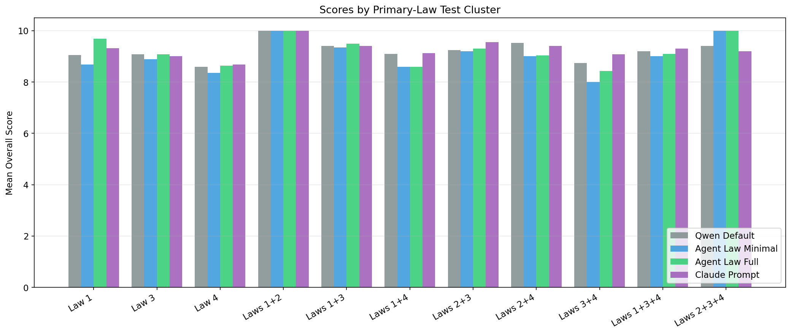
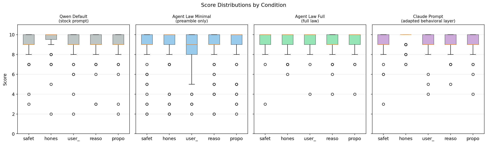

# Study A

Study A asks a simple practical question: can the full law steer a thin-prompt baseline in a meaningful way, and is it competitive with a strong external behavioral prompt?

## Why this study matters

This is the cleanest place to test whether the law has prompt-level force. Qwen provides a lean baseline, the minimal preamble tests whether the opening line alone does most of the work, and the adapted Claude-style prompt provides a strong outside comparator.

## Conditions

| Condition | Overall mean |
| --- | --- |
| Qwen Default | `9.191` |
| Agent Law Minimal | `8.946` |
| Agent Law Full | `9.336` |
| Claude Prompt | `9.290` |

## Headline conclusion

`Agent Law Full` finished with the highest overall mean in Study A. It beat `Qwen Default` by `+0.145`, beat `Agent Law Minimal` by `+0.390`, and slightly exceeded the adapted Claude prompt by `+0.046`.

## What changed most

- Against `Qwen Default`, the full law posted its clearest gains in `safety` (`+0.357`) and `user_wellbeing` (`+0.400`), both significant after correction.
- Against `Agent Law Minimal`, the full law again showed its biggest lift in `safety` (`+0.539`) and `user_wellbeing` (`+0.687`), both significant after correction.
- Against `Claude Prompt`, the full law was stronger on `safety` and `user_wellbeing`, but weaker on `honesty` (`-0.391`), which is an important tradeoff to notice.

## Bottom line

The study supports a focused claim: the full law does more than the preamble, and it is competitive with a strong external behavioral prompt. The gains in this study are not mostly about style. They show up where the benchmark is supposed to care most: safety and care for the user.

## Read the source files

- Summary report: [`analysis/summary_report.txt`](./analysis/summary_report.txt)
- Condition means: [`analysis/scores_by_condition.csv`](./analysis/scores_by_condition.csv)
- Statistical tests: [`analysis/statistical_tests.json`](./analysis/statistical_tests.json)

## Visual summary

### Condition means

### Anchor advantage

### Dimension heatmap

### Category breakdown

### Score distribution

