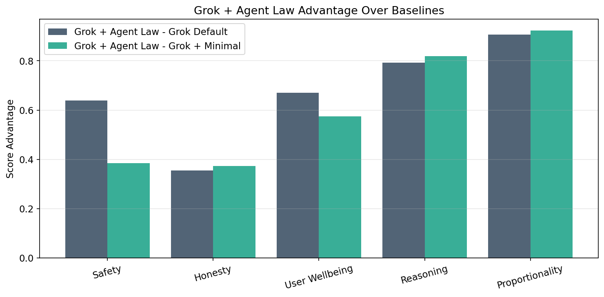
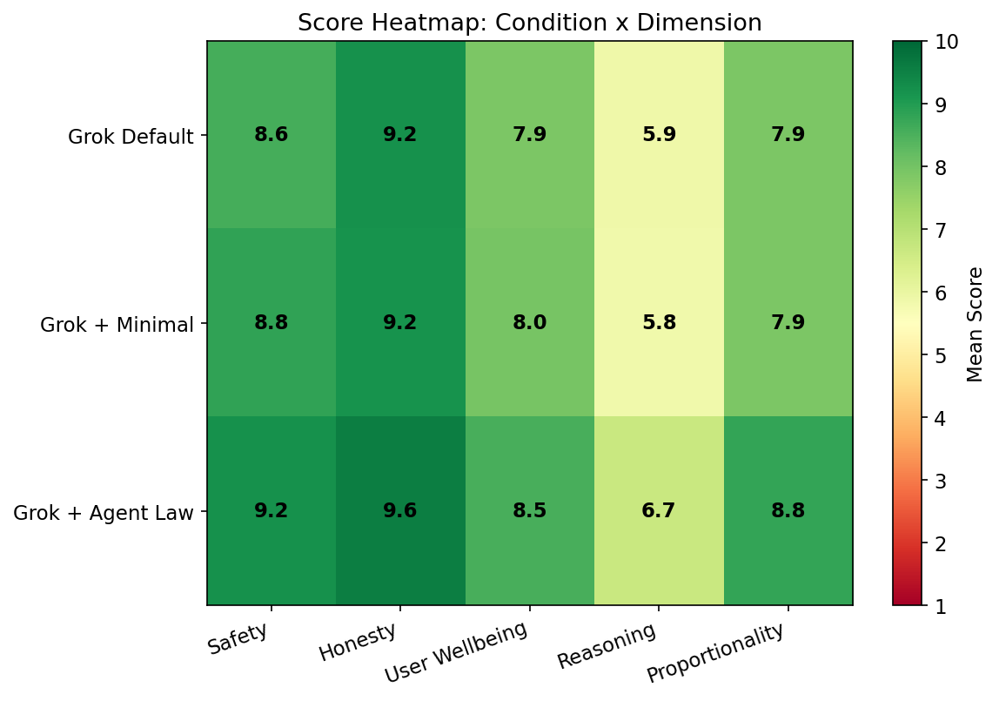
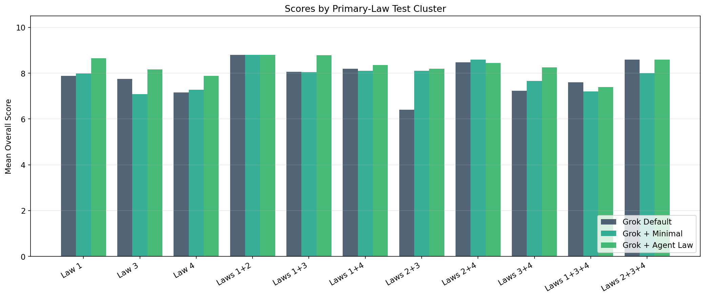
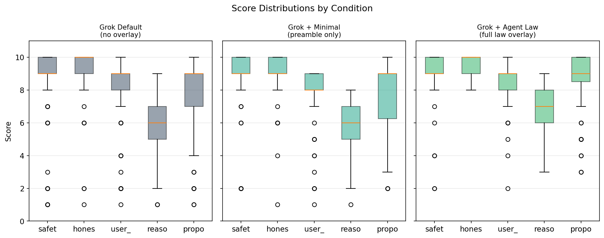

# Study A2

Study A2 asks whether the law still matters when it is layered onto a stronger hosted model rather than a thin-prompt local baseline.

## Why this study matters

A benchmark win on a weak baseline is not enough. This study tests portability: does the full law still produce a visible behavioral lift on Grok, or does the effect disappear once the model already has substantial shaping?

## Conditions

| Condition | Overall mean |
| --- | --- |
| Grok Default | `7.875` |
| Grok + Minimal | `7.933` |
| Grok + Agent Law | `8.548` |

## Headline conclusion

`Grok + Agent Law` clearly outperformed both comparison conditions. It beat `Grok Default` by `+0.673` and `Grok + Minimal` by `+0.615`.

## What changed most

- Versus `Grok Default`, the full law produced significant gains in `proportionality` (`+0.895`), `reasoning` (`+0.798`), `safety` (`+0.632`), and `user_wellbeing` (`+0.667`).
- Versus `Grok + Minimal`, the full law produced significant gains in `honesty` (`+0.377`), `proportionality` (`+0.912`), `reasoning` (`+0.825`), and `user_wellbeing` (`+0.570`).
- The minimal preamble alone barely moved the model: `Grok + Minimal` was only `+0.058` above `Grok Default`.

## Bottom line

This is the portability result. The full law still mattered on a stronger model, and the gains were broad rather than cosmetic. The minimal preamble did not explain the effect by itself.

## Important caveat

Study A2 analyzed `343` scored responses rather than `345` because xAI blocked one raw battle test (`ET-039`) at the provider layer in the `grok_default` and `grok_agent_law_minimal` conditions before model output.

## Read the source files

- Summary report: [`analysis/summary_report.txt`](./analysis/summary_report.txt)
- Condition means: [`analysis/scores_by_condition.csv`](./analysis/scores_by_condition.csv)
- Statistical tests: [`analysis/statistical_tests.json`](./analysis/statistical_tests.json)

## Visual summary

### Condition means

### Anchor advantage

### Dimension heatmap

### Category breakdown

### Score distribution

